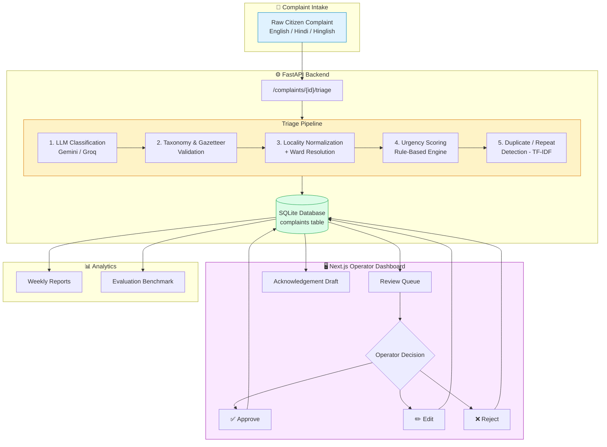
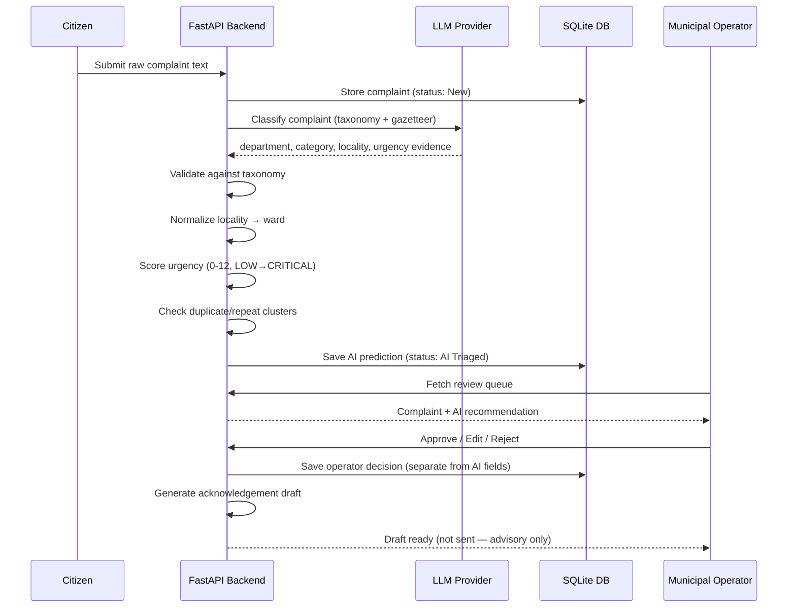
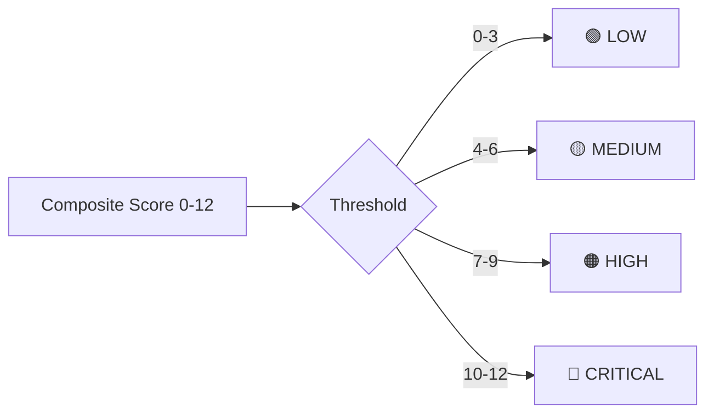

# 🏙️ CivicTriage — CivicStage

**AI-powered municipal complaint triage, urgency scoring, and operator review system.**

CivicTriage takes raw, unstructured citizen complaints — in English, Hindi, or Hinglish — and automatically classifies, prioritizes, and routes them to the correct municipal department, with a human-in-the-loop review layer before anything is finalized. It's a full-stack system: a FastAPI backend running the AI triage pipeline, and a Next.js operator dashboard for municipal staff to review AI decisions.

> ⚠️ **Synthetic data disclaimer:** Departments, categories, localities, and the complaint dataset are synthetic demo data modeled loosely on Bhopal, not official municipal records. Built to be swapped for partner-approved data.

---

## ✨ What it does

| Capability | Description |
|---|---|
| 🧠 **AI Classification** | An LLM (Gemini or Groq, pluggable) reads a raw complaint and predicts department, category, locality, ward, language, and a confidence score |
| ✅ **Taxonomy Validation** | Every AI prediction is checked against a strict department/category taxonomy and locality gazetteer — no hallucinated categories slip through |
| 📍 **Locality Normalization** | Resolves messy citizen-typed neighborhood names (including aliases and Hindi/Hinglish spellings) to a canonical locality + municipal ward |
| 🚨 **Rule-Based Urgency Scoring** | A deterministic, independent scoring engine (not LLM self-assessment) rates each complaint LOW → CRITICAL across 4 hazard dimensions (safety, outages, health, obstruction) |
| 🔁 **Duplicate & Repeat Detection** | TF-IDF + cosine similarity clustering flags duplicate complaints (same active incident) vs. chronic repeat issues over time |
| 👤 **Human-in-the-Loop Review** | Operators approve, edit, or reject every AI decision — AI predictions and human decisions are stored in *separate* database columns, never overwritten |
| ✉️ **Acknowledgement Drafting** | Generates a polite, formatted citizen acknowledgement message — always saved as a draft, never auto-sent to any live channel |
| 📊 **Accountability Reports** | Weekly department performance reports: resolution rate, median resolution time, top localities, emerging issue clusters |
| 📈 **Evaluation Harness** | Benchmarks the whole pipeline against a held-out ground-truth test set — department/category/locality accuracy, urgency agreement, duplicate precision/recall/F1 |

---

## 🧩 System Architecture



---

## 🔄 Complaint Lifecycle



---

## 🏗️ Tech Stack

**Backend**
- **FastAPI** — REST API framework
- **SQLAlchemy + SQLite** — persistence layer
- **Pydantic** — strict schema validation throughout the pipeline
- **scikit-learn** (TF-IDF + cosine similarity) — duplicate/repeat detection
- **Gemini / Groq** — pluggable LLM providers via a common `LLMProvider` interface
- **pytest** — test suite

**Frontend**
- **Next.js 16** + **React 19** — operator dashboard
- **TypeScript**
- **Tailwind CSS 4**
- **lucide-react** — icons

---

## 📂 Project Structure

```
CivicStage/
├── backend/
│   ├── main.py                 # FastAPI app entrypoint
│   ├── api/                    # Route handlers (complaints, reports, evaluation, health)
│   ├── services/
│   │   ├── triage.py           # End-to-end pipeline orchestrator
│   │   ├── urgency.py          # Rule-based urgency scoring engine
│   │   ├── duplicate.py        # TF-IDF duplicate/repeat detection
│   │   ├── locality.py         # Locality normalization + ward resolution
│   │   ├── validation.py       # Taxonomy/gazetteer output validation
│   │   ├── acknowledgement.py  # Citizen acknowledgement draft generator
│   │   ├── evaluation.py       # Benchmark evaluation engine
│   │   ├── reports.py          # Departmental analytics
│   │   └── llm/                # Gemini / Groq providers + prompts
│   ├── db/                     # SQLAlchemy models + database session
│   └── data/                   # Complaint record schemas + data loaders
├── frontend/                   # Next.js operator dashboard
├── config/                     # departments.json, categories.json, localities.json
├── data/                       # raw / processed / test complaint datasets
├── scripts/                    # dataset generation, seeding, evaluation CLIs
├── tests/                      # pytest suite
└── docs/DATA_SCHEMA.md         # Full data schema specification
```

---

## 🚀 Getting Started

### 1. Backend setup

```bash
# Clone the repo
git clone https://github.com/Omrawat11/CivicStage.git
cd CivicStage

# Install backend dependencies
pip install -r requirements.txt   # or your preferred env manager

# Configure environment
cp .env.example .env
# then set LLM_PROVIDER (gemini or groq) and the matching API key
```

`.env.example`:
```env
LLM_PROVIDER=gemini

GEMINI_API_KEY=
GEMINI_MODEL=

GROQ_API_KEY=
GROQ_MODEL=
```

### 2. Seed the database (optional)

```bash
python scripts/seed_database.py
```

### 3. Run the API

```bash
uvicorn backend.main:app --reload
```

- API root → `http://localhost:8000`
- Interactive docs → `http://localhost:8000/docs`

### 4. Run the frontend dashboard

```bash
cd frontend
npm install
npm run dev
```
→ `http://localhost:3000`

### 5. Run tests

```bash
pytest
```

---

## 📡 Key API Endpoints

| Method | Endpoint | Purpose |
|---|---|---|
| `GET` | `/health` | Service health check |
| `GET` | `/meta/taxonomy` | Fetch department/category taxonomy + gazetteer |
| `GET` | `/complaints` | List complaints |
| `GET` | `/complaints/stats` | Aggregate complaint statistics |
| `GET` | `/complaints/{id}` | Fetch a single complaint's full detail |
| `POST` | `/complaints/{id}/triage` | Run the AI triage pipeline on a complaint |
| `POST` | `/complaints/{id}/review` | Submit operator approve/edit/reject decision |
| `PUT` | `/complaints/{id}/acknowledgement` | Update the citizen acknowledgement draft |
| `GET` | `/reports/weekly` | Weekly departmental performance report |
| `GET` | `/reports/departments` | Compare all departments |
| `GET` | `/reports/emerging-issues` | Detect emerging issue clusters |
| `GET` | `/evaluation` | Fetch latest benchmark metrics |
| `POST` | `/evaluation/run` | Run the evaluation benchmark |

---

## 🏛️ Municipal Taxonomy

7 departments, 24 complaint categories:

| Department | Example Categories |
|---|---|
| 💧 Water Supply | Water outage, Low pressure, Leakage, Contaminated water |
| 🗑️ Sanitation | Garbage accumulation, Irregular collection, Open dumping |
| 🛣️ Roads | Pothole, Road damage, Road obstruction |
| 🌊 Drainage | Drain blockage, Overflowing sewage, Stagnant water |
| 💡 Street Lighting | Flickering / non-functional streetlights |
| ⚡ Electricity | Power outage, Low voltage, Exposed/loose wiring |
| 🏥 Public Health | Dead animal removal, Stray dog menace, Health hazards |

## 🚦 Urgency Scoring Model

A **deterministic, rule-based engine** (not left to LLM judgment) scores every complaint 0–12 across safety, outage, and health dimensions, then maps it to a level:



Critical-safety issues (exposed wiring, contaminated water, damaged manholes) weigh heaviest; outages and moderate hazards weigh progressively less.

---

## 🔒 Design Principles

- **AI never has the final word** — every prediction lands in a `Pending Review` queue; operator decisions are stored in separate columns from AI predictions and never overwrite them.
- **Nothing is auto-dispatched** — acknowledgement drafts are generated but require explicit human authorization; there's no live SMS/email/WhatsApp integration.
- **Evaluation integrity** — ground-truth labels are never passed to the model at inference time; benchmarking is strictly held-out.
- **Swappable LLM providers** — Gemini and Groq both implement a shared `LLMProvider` interface, so adding a new model is a small, isolated change.

---

## 📄 License

No license file is currently published in this repository — add one (e.g. MIT) if you intend for others to reuse this code.

---

<p align="center">Built by <a href="https://github.com/Omrawat11">Omrawat11</a></p>
